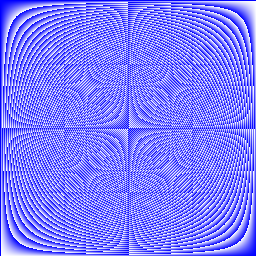
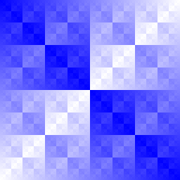

# exercise-slices

This exercise is awesome, I'd like to extend this program in the future to
actually pass a function to be parsed and generate images for.

## Images from the exercise:

### Average

### Product

### Xor

